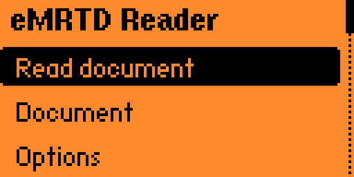
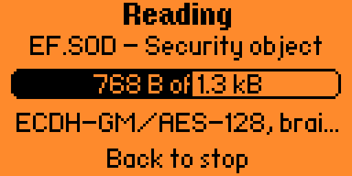

<p align="center">
  
</p>

<p align="center">
  <em>Passport, identity card, residence permit - one chip, two protocols.
  This one speaks both.</em>
</p>

<p align="center">
  <a href="https://github.com/filipsedivy/emrtd-flipperzero/actions/workflows/build.yml"></a>
  <a href="https://github.com/filipsedivy/emrtd-flipperzero/actions/workflows/test.yml"></a>
  <a href="docs/install.md"></a>
  <a href="LICENSE"></a>
</p>

---

eMRTD reads the contactless chip in an electronic identity document - a
passport, a national identity card or a residence permit, all built to **ICAO
Doc 9303** - on a **Flipper Zero**, and writes every data group it can reach to
the SD card. No computer, no serial cable, no companion application. It is not
told which document it is facing: it opens whatever `EF.CardAccess` announces,
and the only differences that reach you are the key you type and the layout of
the zone decoded afterwards.

<p align="center">
  
  
  
</p>

<p align="center">
  <em>A read of the ICAO specimen - <code>L898902C</code>, ANNA MARIA ERIKSSON
  of Utopia, who is not a person - captured from a build variant that ran
  against a simulated chip, and that the package does not ship.</em>
</p>

## Why PACE

The readers that came before this one implement **BAC**, the access protocol of
2006. BAC is being withdrawn, and a document issued in the European Union after
2017 may implement **PACE** only - against such a chip a BAC reader gets as far
as the first command and stops. An identity card issued in the Union since 2021
is exactly that case. eMRTD implements both and runs PACE first, because that is
what a modern document announces.

## What it does

- **Access control**: PACE with the generic mapping over ECDH, and BAC over
  3DES, chosen from what the chip announces.
- **Secure Messaging** for both cipher families, checked byte for byte against
  the ICAO test vectors.
- **Its own ISO-DEP layer** on type A, because the firmware's poller gives a
  card a waiting time no eMRTD chip can meet.
- **Reads** EF.COM, EF.SOD and the non-EAC data groups, and checks every group
  against the hash EF.SOD lists for it.
- **Exports** the raw files, the decoded MRZ, the facial image and a report to
  a directory per document.

The signature on EF.SOD, the EAC-protected groups DG3 and DG4, and writing to a
chip are all out of reach, for reasons that are measured rather than guessed;
[docs/capabilities.md](docs/capabilities.md) has the full matrix, and which
documents count as an eMRTD in the first place.

**A read that shows every hash matching says the chip is internally consistent,
nothing more** - the signature is not checked, so this reader cannot tell a
genuine document from a well made copy of one.

## Tested documents

| Document | Key you type | Access | Data groups | Hashes |
| --- | --- | --- | --- | --- |
| Czech passport | the three MRZ values | BAC, 3DES - `EF.CardAccess` could not be read | DG1, DG2, DG14, DG15; DG3 announced and skipped | all four match |
| Czech identity card, 2021 series | **the CAN** | PACE-ECDH-GM, AES-128, NIST P-256 - `EF.CardAccess` read | DG1 as TD1, DG2, DG14, DG15; DG3 announced and skipped | all four match |

Both rows were read on the device, so **PACE has now run against a real chip**
rather than only against the ICAO test vectors and the host simulator;
[docs/capabilities.md](docs/capabilities.md) has what else each read established
and what a host reference implementation confirmed. Rows come from pull
requests, and [CONTRIBUTING.md](CONTRIBUTING.md) says what may be written down
about a document.

## Install

```bash
pip install --upgrade ufbt
ufbt update --channel=release      # official firmware; see docs/install.md for others
ufbt launch                        # build, upload and start
```

Unleashed and Momentum need their own SDK, and a package built for one firmware
will not start on another. [docs/install.md](docs/install.md) has the channels,
the prebuilt packages and the app catalogue route.

## Reading a document

```
Start -> Document (number, date of birth, date of expiry, or a CAN)
      -> Read     select application -> EF.CardAccess -> PACE or BAC
                  -> Secure Messaging -> EF.COM -> EF.SOD -> the data groups
                  -> hashes against EF.SOD -> export
      -> Result   holder, document, security, files, photo
```

The key is whatever the document prints on itself, which is why reading only
works with it in hand. Each read lands in its own directory under
`/ext/apps_data/emrtd/`, and that directory is a complete identity.
[docs/usage.md](docs/usage.md) describes every screen, where to hold the
document and what the export contains; [docs/security.md](docs/security.md)
says what to do about what it leaves behind.

## Documentation

| Page | What is in it |
| --- | --- |
| [install.md](docs/install.md) | Firmware channels, ufbt, the app catalogue |
| [usage.md](docs/usage.md) | Every screen, what to type, where the export lands |
| [capabilities.md](docs/capabilities.md) | What it reads, what it refuses, and why |
| [troubleshooting.md](docs/troubleshooting.md) | What each error means and what to try |
| [trace.md](docs/trace.md) | The APDU trace: its format, how to read one, how to turn one into a change |
| [security.md](docs/security.md) | What is sensitive, and what the repository does about it |
| [architecture.md](docs/architecture.md) | The layers, and why the access drivers are a registry |
| [protocol.md](docs/protocol.md) | The APDU sequence, and the frame size that shapes it |
| [cryptography.md](docs/cryptography.md) | BAC, PACE, Secure Messaging, and the vector that pins each step |
| [platform.md](docs/platform.md) | What the firmware's mbed TLS can and cannot do, measured |
| [branding.md](docs/branding.md) | Why the mark is six pads on a ten by ten grid |
| [SECURITY.md](SECURITY.md) | Reporting a vulnerability, privately |

Building, testing and the house rules: [CONTRIBUTING.md](CONTRIBUTING.md).

## Legal note

Use this on your own document, or with the explicit and informed consent of the
person whose document it is. Access requires physical possession, because the
key is derived from what is printed on the document itself - but consent is not
implied by possession, and a facial image is biometric data. Whatever you
export is subject to the rules that apply where you are.

## Support

The work behind this is a chip, a specification and a lot of measuring. If it
saved you some of that, you can buy me a coffee:
[buymeacoffee.com/filipsedivy](https://buymeacoffee.com/filipsedivy). The same
link is in the application's menu under Donate, as a QR code.

## License

MIT - see [LICENSE](LICENSE).
